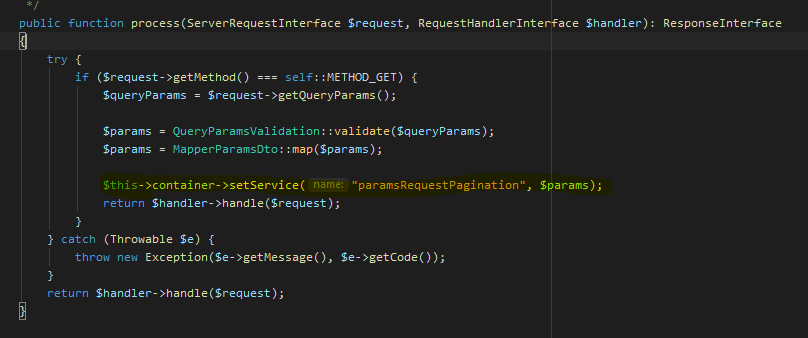
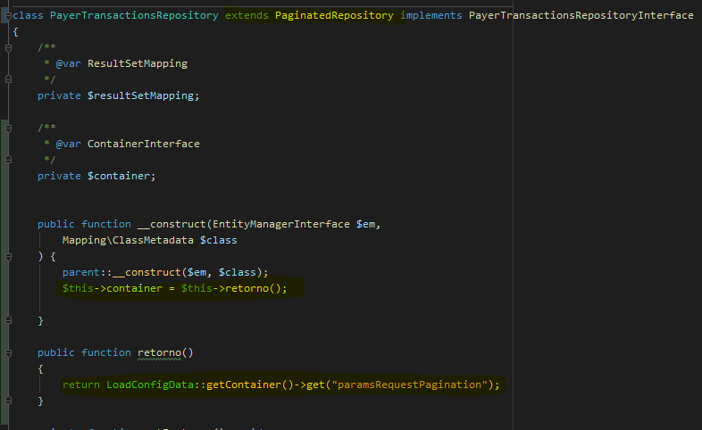
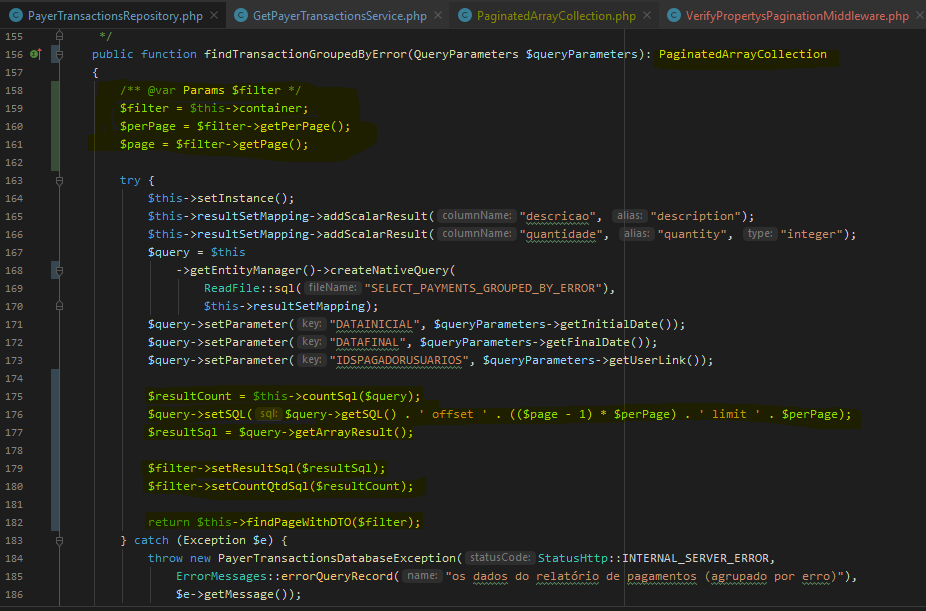
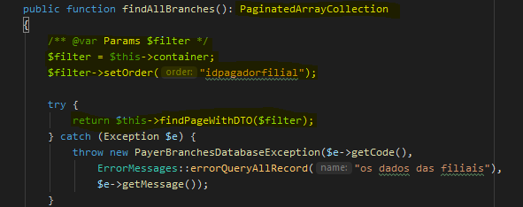

# Pagination
## 1 criar middleware para popular container interface e registrar a mesma na Pipeline do seu projeto
  

 ## 2 Para uso basta estender PaginatedRepository em seu Repositorio e pegar o valor do queryParams dentro do container atraves de um construtor
   

 ### 2-a Implementando busca em arquivo SQL no Repositorio
  

### 2-b Implementando busca normal no Repositorio

